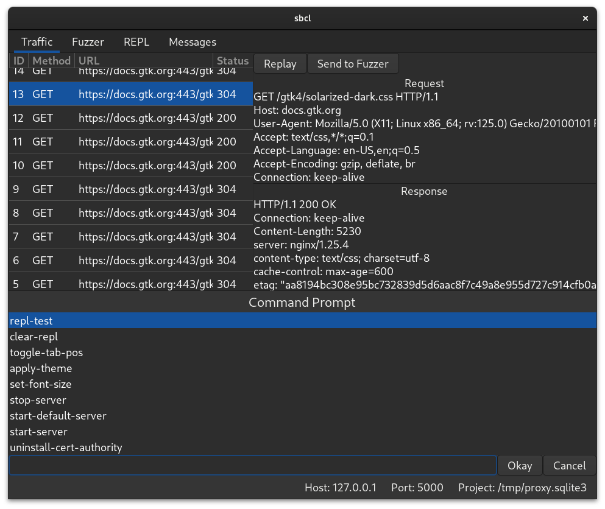

An interactive web proxy for debugging and testing HTTP servers.
Automatically generates certificates to intercept and decrypt SSL messages.

# GTK frontend

Depends on:
- SBCL + Ultralisp
- [FiloSottile/mkcert](https://github.com/FiloSottile/mkcert)
- SQLite
- GTK4

```bash
make gtk
```

　

# Tk frontend

Depends on:
- SBCL + Quicklisp
- [FiloSottile/mkcert](https://github.com/FiloSottile/mkcert)
- SQLite
- Tk/Tcl

```bash
make tk
```

　

# Lem frontend

Depends on:
- Lem
- [FiloSottile/mkcert](https://github.com/FiloSottile/mkcert)
- SQLite

```lisp
(ql:quickload '(:mx-proxy :mx-proxy/lem))
```

　

# Hooks

The proxy server uses the following hooks which you can attach functions to:
| Hook               | Args               |
| ------------------ | ------------------ |
| :on-request        | request            |
| :on-response       | request response   |
| :on-message-pair   | message-pair       |
| :init              | (none)             |
| :on-command        | command            |
| :on-load-project   | (none)             |

# Commands

Use `define-command` to add interactive functionality. The `mx-proxy` namespace
exports this macro in Tk and Qt frontends, Lem has its own implementation which
behaves the same.

# Configuration

The configuration directory is one of the following, in descending priority:
- `~/.config/mx-proxy/`
- `~/.mx-proxy/`
- `$MX_PROXY_HOME`

Persistent settings are stored in `config.lisp` as a plist dictionary.
After the program has loaded, it will also load `init.lisp`, you can load
any external packages you want from here.

# Installation notes

Make sure `mkcert` is in your path and you have run `mkcert -install` and restarted your browser.
