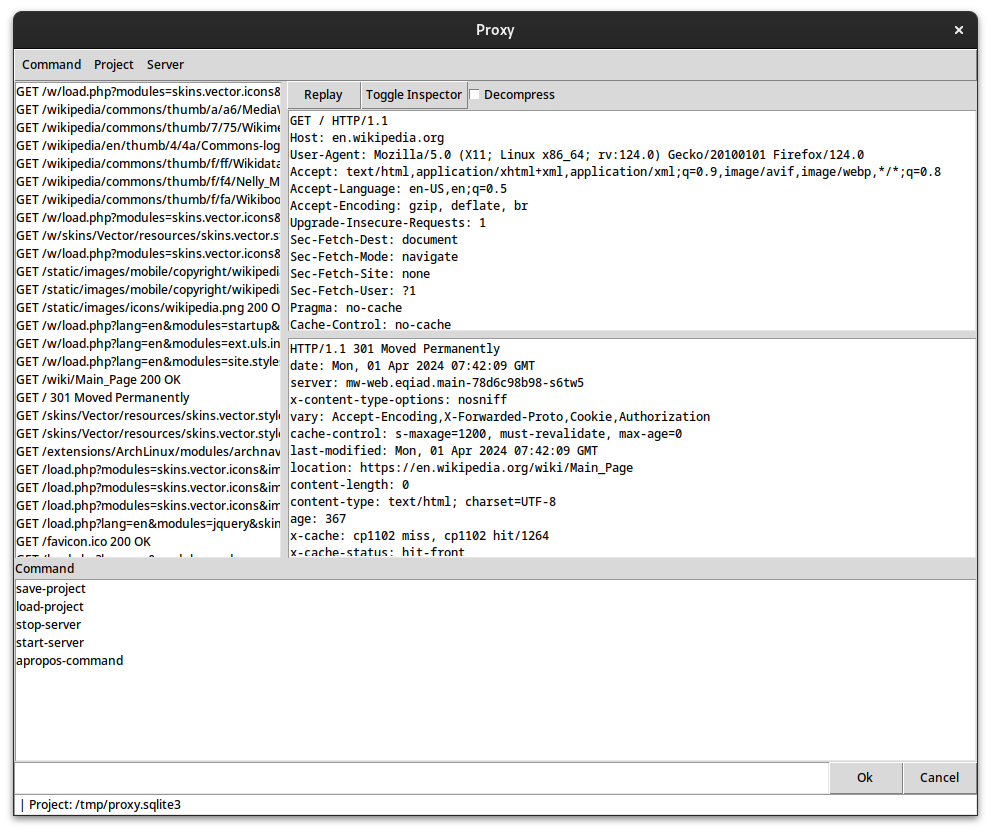

An interactive web proxy.

# Tk frontend

Depends on:
- SBCL + Quicklisp
- FiloSottile/mkcert
- SQLite
- Tk/Tcl

```bash
make tk
```

　

# Lem frontend

Depends on:
- Lem
- FiloSottile/mkcert
- SQLite

```lisp
(ql:quickload '(:mx-proxy :mx-proxy/lem))
```

　

# Hooks

The proxy server uses the following hooks which you can attach functions to:
- :on-request      - args: http:request
- :on-response     - args: http:request http:response
- :on-message-pair - args: http:message-pair

# Commands

Use `define-command` to add interactive functionality. The `mx-proxy` namespace
exports this macro in Tk and Qt frontends, Lem has its own implementation which
behaves the same.
